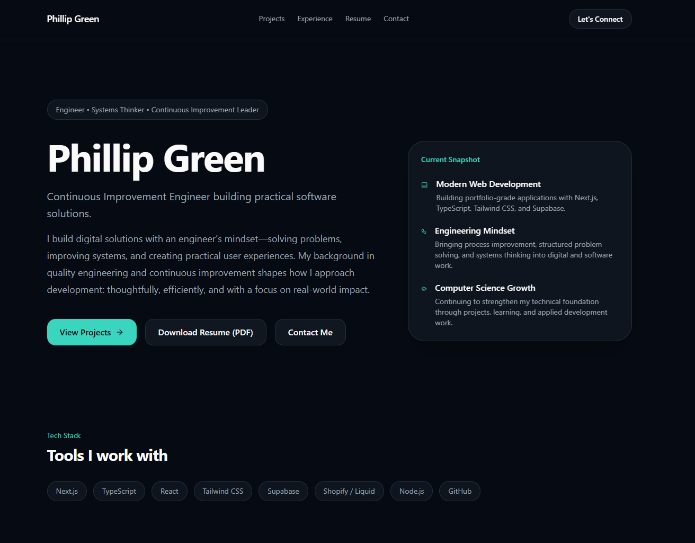

# Phillip Green

Continuous Improvement Engineer building practical software solutions.

---


---

## Portfolio

Live Site  
https://phillip-portfolio-phi.vercel.app

This repository contains the source code for my **developer portfolio website**.

The site highlights my projects, engineering background, and development work as I continue growing in modern web development.

---

## About Me

I am a **Continuous Improvement Engineer** with a background in:

- Quality engineering
- Root cause analysis
- Process optimization
- Systems thinking

Alongside my engineering career, I actively build **modern web applications and development tools**.

My goal is to combine **engineering discipline with software development** to create practical and efficient digital systems.

---

## Featured Projects

### Abide

A Bible study platform built to help groups stay connected through weekly studies, discussion, progress tracking, and prayer requests.

Tech Stack

Next.js  
TypeScript  
Supabase  
PostgreSQL

---

### CyberDev VS Code Theme

A custom Visual Studio Code theme designed to improve development ergonomics with a modern cyber-inspired aesthetic.

VS Code Marketplace  
https://marketplace.visualstudio.com/items?itemName=PhillipGreen.cyberdev

GitHub  
https://github.com/phillipggreen/cyberdev-vscode

---

### KRM NXT MOD

A Shopify storefront customized for a real client selling golf cart parts.

Tech Stack

Shopify  
Liquid  
HTML  
CSS  
JavaScript

Live Site  
https://krmnxtmod.com

---

### Green Digital Solutions

A small business website created to provide a professional digital presence for a service-based brand.

Tech Stack

HTML  
CSS  
JavaScript

Live Site  
https://greendigitalsolutions.dev

---

## Tech Stack

This portfolio was built using modern web technologies:

Next.js  
TypeScript  
React  
Tailwind CSS  
Supabase  
Vercel

---

## Running the Project Locally

Clone the repository

```bash
git clone https://github.com/phillipggreen/phillip-portfolio.git
````

Install dependencies

```bash
npm install
```

Run development server

```bash
npm run dev
```

Open in browser

[http://localhost:3000](http://localhost:3000)

---

## Deployment

The portfolio is deployed using **Vercel**.

Every push to the **main branch automatically triggers a new deployment**.

---

## Connect With Me

LinkedIn
[https://linkedin.com/in/phillipggreen](https://linkedin.com/in/phillipggreen)

GitHub
[https://github.com/phillipggreen](https://github.com/phillipggreen)

Portfolio
[https://phillip-portfolio-phi.vercel.app](https://phillip-portfolio-phi.vercel.app)

```


